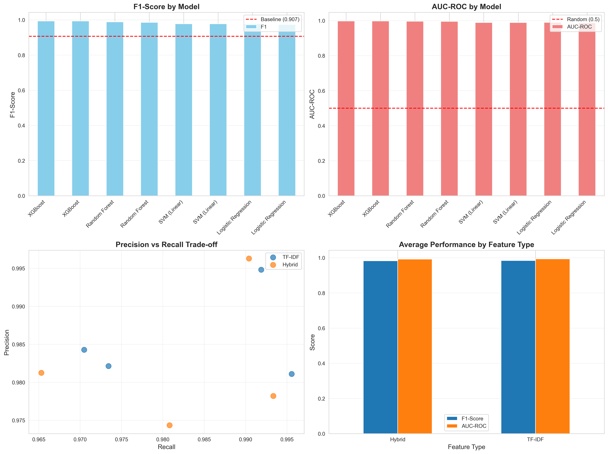
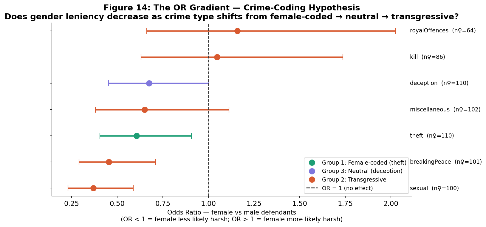

# Decoding Justice: ML Analysis of Old Bailey Criminal Proceedings (1902–1913)

**NUS LL5532X — Law, Algorithms, and Artificial Intelligence**
Group 3: Nitin Parab · Pakhale Kalyani Vijay · Shao Lujie · Zhang Xiaoyue
Supervisor: Prof. Ilya Akdemir

This is my personal copy of a group project — reorganized for my portfolio with full credit to my teammates above. The team's original repository is at [github.com/zhangxiaoyue311-cmd/LL5532X](https://github.com/zhangxiaoyue311-cmd/LL5532X).

## Overview

We applied machine learning and NLP to **9,192 digitised criminal trial records** from London's Old Bailey (1902–1913) to investigate whether historical legal proceedings encode systematic patterns of prediction, bias, and sentencing — a question sitting at the intersection of legal history, algorithmic fairness, and text classification.

Three research questions:

1. **Verdict Prediction (RQ1):** Can case narrative text predict guilty vs. not guilty verdicts?
2. **Gender Bias in Sentencing (RQ2):** Does defendant gender affect punishment severity after controlling for case-level factors?
3. **Punishment Type Prediction (RQ3):** Can we predict punishment type for convicted defendants?

## Key findings

- **RQ1 — Verdict prediction:** XGBoost + TF-IDF reaches **99.33% F1** / 0.998 AUC-ROC, far above the majority-class baseline (90.7% F1). This result comes with an important caveat we investigated directly: trial narratives often contain sentencing language that leaks the outcome (e.g. a scribe noting the sentence within the same record), so the near-perfect score is itself evidence of how deeply outcomes are embedded in the surrounding text — not a claim that verdicts are "predictable" from evidence alone.
- **RQ2 — Gender bias in sentencing:** Female defendants received less harsh punishment at the raw level (OR ≈ 0.44), attenuating to OR ≈ 0.83 after full controls — with the confidence interval crossing 1.0, meaning the *aggregate* effect isn't statistically significant once confounders are added, and instead operates through structural crime-type sorting rather than direct judicial discrimination. But aggregation hides sharp crime-specific variation: sexual offences show near-total leniency for women (OR ≈ 0.37), while **violent theft shows a dramatic "double deviance" effect (OR ≈ 4.03)** — women who violated Victorian gender norms of feminine passivity were punished far more harshly than men convicted of the same crime. The finding that a null aggregate effect conceals a 4x subgroup disparity is itself the paper's methodological point: aggregate fairness metrics can miss critical subgroup harms.
- **RQ3 — Punishment type prediction:** LightGBM on structured + text features reaches **macro F1 = 0.854** across four punishment categories, with text features substantially outperforming structured-features-only baselines.

Read together, the three RQs trace a **bias propagation pipeline**: judicial decisions shaped by the norms of the time were recorded in trial text → that text encodes those norms → models trained on the text learn to reproduce them. That's as relevant to modern algorithmic fairness in legal/criminal-justice AI as it is to Edwardian legal history.

## Data

[Old Bailey Proceedings Online](https://www.oldbaileyonline.org/), parsed from XML via the Digital Humanities Institute's Old Bailey API.

| Property | Value |
|---|---|
| Trial records | 9,192 |
| Period | 1902–1913 |
| Raw features | 19 |
| Engineered features | 58 |
| Verdict split | ~80% guilty / ~20% not guilty |
| Gender split | ~90% male / ~10% female |
| Dominant crime type | Theft (>50% of trials) |

The raw and fully-processed datasets (several hundred MB) aren't included in this repo to keep it browsable — `notebooks/00_xml_extraction.ipynb` documents the full extraction pipeline from the Old Bailey API, and `notebooks/03_data_preparation.ipynb` documents cleaning and feature engineering.

## Methodology

DRME pipeline (Data → Representation → Model → Evaluation):

- **EDA & feature engineering** — text cleaning, tokenisation, lemmatisation (spaCy), POS tagging, named-entity extraction, VADER sentiment, LDA topic modelling, readability indices. Vocabulary reduced from 62,488 to 34,210 tokens.
- **RQ1 (verdict prediction)** — binary classification: TF-IDF + Logistic Regression, Naive Bayes, SVM, and XGBoost, compared against a majority-class baseline, with an explicit data-leakage investigation.
- **RQ2 (gender bias)** — progressive logistic regression isolating the defendant-gender effect on sentencing while controlling for crime type, text length, and temporal factors, with SHAP-based interpretation of the model.
- **Causal-inference extension** (`notebooks/rq3_causal_inference.ipynb`, contributed by Kalyani) — a complementary, more rigorous causal analysis of a related question: whether "male defendant, female victim" cases receive systematically different sentences. Rather than reading off a raw correlation, it builds an explicit causal DAG, identifies a backdoor-adjustment confounder set (offence topic, evidence intensity, text complexity, narrative sentiment), estimates the treatment effect on sentencing severity with multiple estimators, and stress-tests the result with refutation diagnostics.
- **RQ3 (punishment type)** — multiclass classification (4 punishment groups) using LightGBM with structured + text features, plus a supplementary fine-tuning and qualitative "close reading" pass on ambiguous cases.

## Model comparison — RQ1 (verdict prediction)

| Model | Features | Accuracy | Precision | Recall | F1 | AUC-ROC |
|---|---|---:|---:|---:|---:|---:|
| **XGBoost** | TF-IDF | 98.90% | 99.48% | 99.19% | **99.33%** | 0.998 |
| XGBoost | Hybrid | 98.90% | 99.63% | 99.04% | 99.33% | 0.998 |
| Random Forest | TF-IDF | 98.04% | 98.11% | 99.56% | 98.83% | 0.996 |
| Random Forest | Hybrid | 97.61% | 97.82% | 99.34% | 98.57% | 0.995 |
| SVM (Linear) | TF-IDF | 96.33% | 98.21% | 97.34% | 97.78% | 0.989 |
| Logistic Regression | TF-IDF | 96.27% | 98.43% | 97.05% | 97.73% | 0.990 |
| Baseline (majority class) | — | 82.93% | 82.93% | 100% | 90.67% | 0.500 |



## RQ2 — Gender odds ratios by crime type

The aggregate gender effect (OR ≈ 0.83, not statistically significant) masks sharp variation by crime type — most offences show leniency toward female defendants (OR < 1), with confidence intervals widening for rarer crime categories (small n).



## Repo contents

```
decoding-justice-old-bailey-ll5532x/
├── notebooks/
│   ├── 00_xml_extraction.ipynb          # Parse raw Old Bailey XML into structured records
│   ├── 01_eda.ipynb                     # Descriptive statistics & visualization
│   ├── 02_research_based_eda.ipynb      # NLP feature engineering & close reading
│   ├── 03_data_preparation.ipynb        # Cleaning, anomaly resolution, feature prep for modeling
│   ├── final_unified_notebook.ipynb     # All three RQs combined, executed end-to-end
│   ├── rq1_verdict_prediction.ipynb     # RQ1: LR / NB / SVM / XGBoost + leakage analysis
│   ├── rq2_gender_bias.ipynb            # RQ2: progressive logistic regression + SHAP
│   ├── rq3_punishment_prediction.ipynb  # RQ3: LightGBM multiclass punishment prediction
│   ├── rq3_finetuning_close_reading.ipynb  # RQ3 supplementary: tuning + qualitative case review
│   └── rq3_causal_inference.ipynb       # Causal-inference analysis on guilty sentences
├── docs/
│   ├── project_proposal.pdf
│   ├── research_report_final.pdf / .md
│   ├── rq1_summary_report.md
│   └── rq3_causal_inference_insights.docx
├── figures/
│   ├── rq1/   # 10 figures: model comparison, feature importance, confusion, etc.
│   ├── rq2/   # 13 figures: SHAP plots, ROC, gender coefficients, temporal trends
│   └── rq3/   anomaly_pie.png
├── slides/
│   └── causal_inference_rq3_old_bailey.pptx
├── models/
│   ├── rq1_logistic_regression_model.pkl
│   └── rq1_tfidf_vectorizer.pkl
├── scripts/
│   ├── rq1_predict.py                   # Load the saved model and predict on new text
│   └── rq1_model_usage_demo.py
└── data/
    ├── rq1_model_comparison_results.csv
    └── rq1_statistical_summary.csv
```

## Running the notebooks

```bash
pip install pandas numpy scikit-learn xgboost lightgbm spacy matplotlib seaborn nltk
python -m spacy download en_core_web_sm
```

Suggested order: `00_xml_extraction` → `01_eda` → `02_research_based_eda` → `03_data_preparation` → each RQ notebook independently (or `final_unified_notebook.ipynb` for all three end-to-end in one pass).

## Tech stack

Python, pandas, scikit-learn, XGBoost, LightGBM, spaCy, NLTK, SHAP, statsmodels, matplotlib, seaborn.

---
Part of the [nus-masters-projects](../) portfolio — coursework from the NUS MSc in AI and Innovation.
