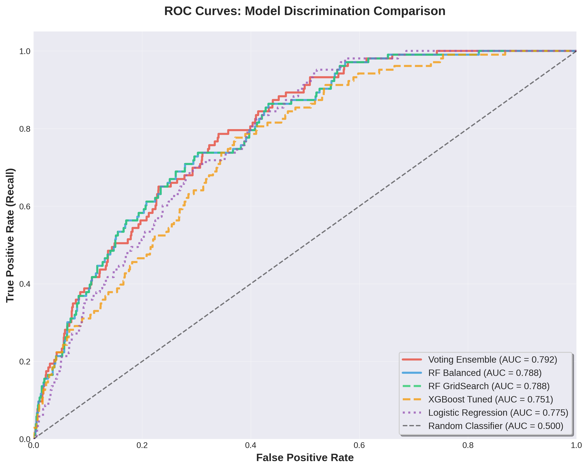
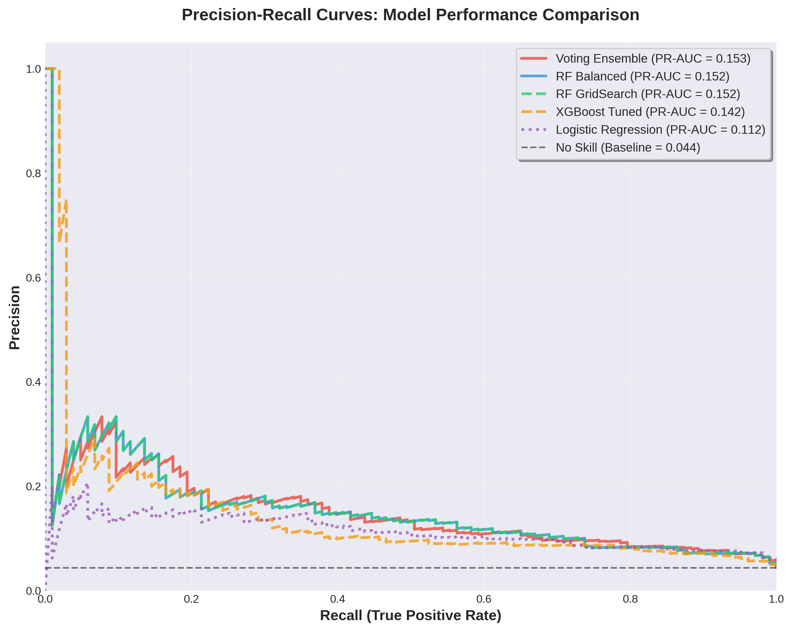
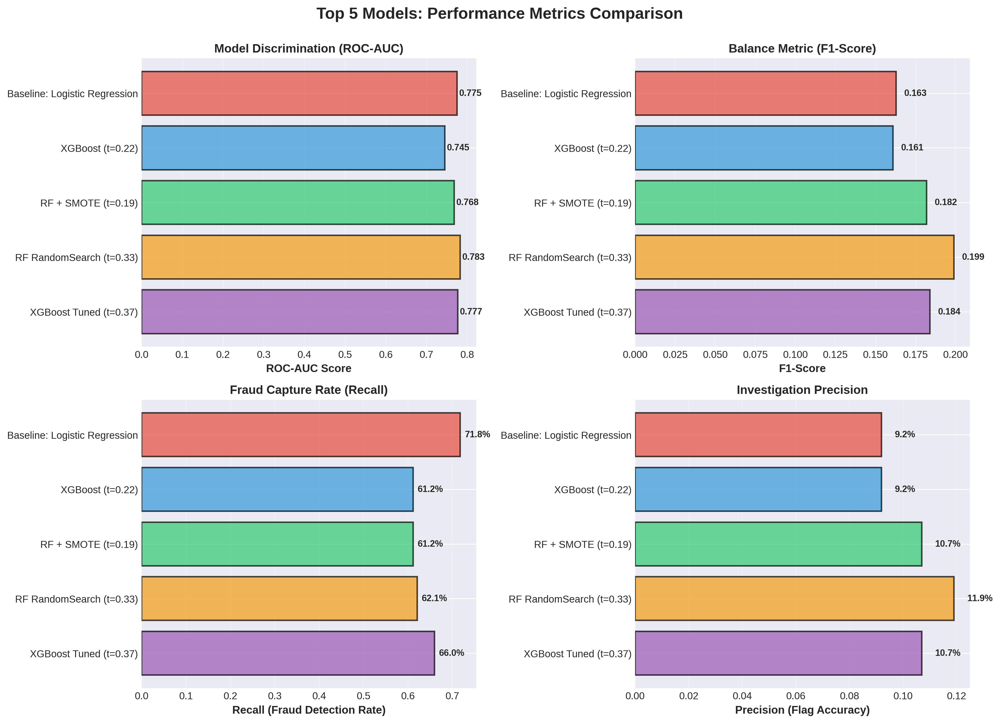
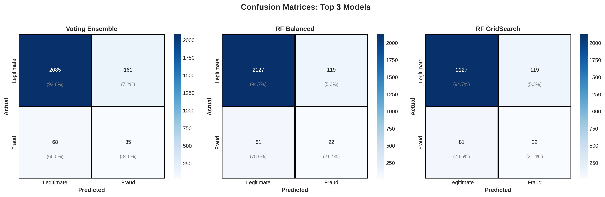
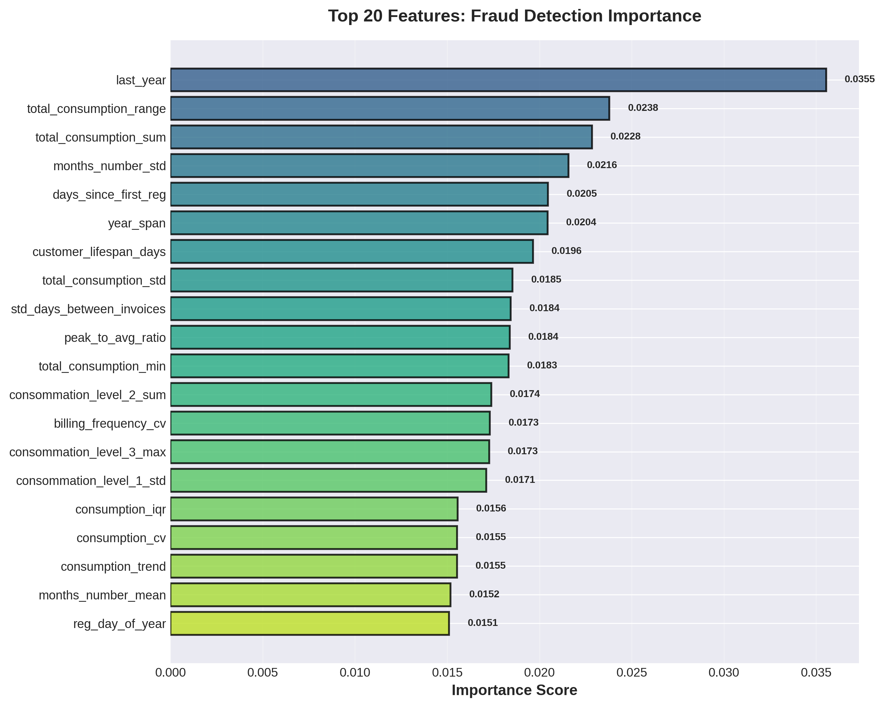
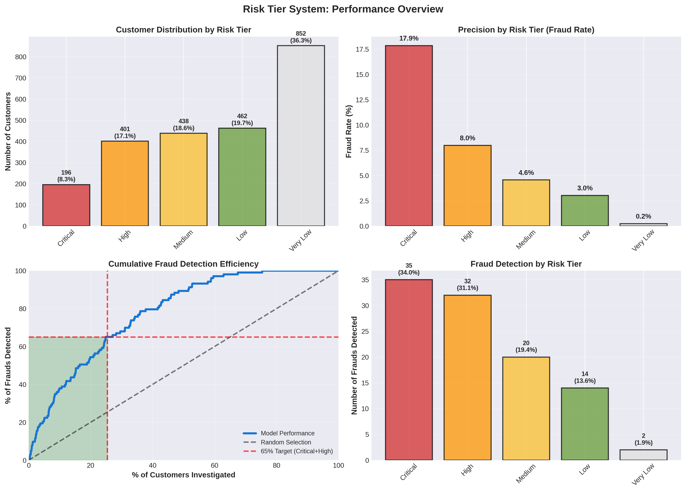
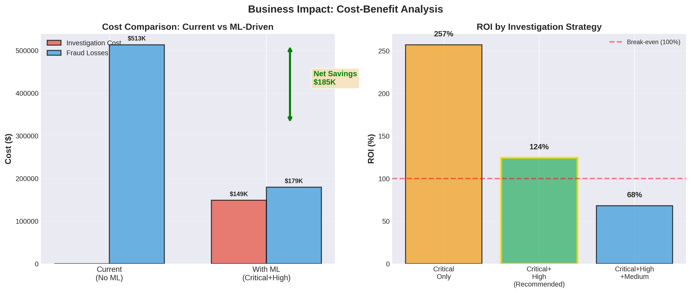
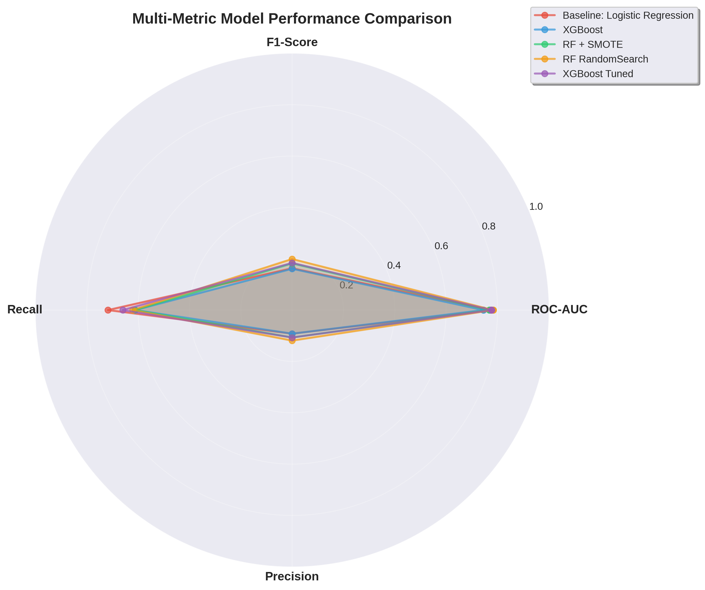

# Fraud Detection in Electricity & Gas Consumption

**NUS MSI5001 — Introduction to AI: Concepts, Applications, and Evaluation**
Team 14: Prasad, Benhur, Nitin, Low Xuan Yin

A machine learning system that flags fraudulent electricity and gas accounts from billing and consumption history, so a utility's investigation team can focus manual reviews on the customers most likely to be committing fraud.

## Results at a glance

| Metric | Value |
|---|---|
| Best model | Voting Ensemble (Random Forest + XGBoost + Logistic Regression, weighted 2:1:1) |
| ROC-AUC | 0.792 |
| Recall | 65.0% of fraud cases caught |
| Customers flagged for review | 25.4% (Critical + High risk tiers) |
| Estimated ROI | 124% ($185K net benefit, scaled to 11,710 customers) |

The headline trade-off: investigating roughly a quarter of the customer base catches about two-thirds of all fraud, instead of reviewing every account.

## Problem

Energy theft is a persistent, costly problem for utility companies — beyond direct revenue loss, it undermines supply reliability and fairness for paying customers. Manually auditing every account for suspicious usage doesn't scale, so this project frames fraud detection as a binary classification problem: given a customer's billing and consumption history, predict whether they're likely committing fraud.

The dataset covers over 11,000 customers with client-level and invoice-level records, and is highly imbalanced — only 4.39% of customers are labelled fraudulent (a 22:1 imbalance), which shaped most of the modeling decisions below.

## Approach

1. **Data cleaning & EDA** — merged electricity and gas billing records, handled missing values and outliers (Winsorization at the 99th percentile), and explored fraud patterns. Notable finding: fraudulent customers consume 21% *less* on average than legitimate ones, and one customer category (Category 11) has a 6.9x higher fraud rate than the base rate.
2. **Feature engineering** — aggregated invoice-level data to the customer level and built 110 features (consumption statistics, ratios, behavioral flags, categorical encodings). Feature reduction was tested (110 → 30/40/50) but hurt performance, so all 110 were kept.
3. **Modeling** — started from a Logistic Regression baseline, then trained Random Forest, XGBoost, and RF+SMOTE with class-imbalance handling (class weighting, SMOTE, scale_pos_weight). Also tested LightGBM and a LightGBM + Isolation Forest hybrid for rare-pattern detection, and time-based features from invoice history — neither improved on the tree ensembles.
4. **Tuning** — RandomizedSearchCV (50 combinations, 5-fold CV) followed by GridSearchCV, plus precision–recall threshold tuning per model rather than using a fixed 0.5 cutoff.
5. **Ensembling** — a Voting Classifier (Random Forest + XGBoost + Logistic Regression, weights [2,1,1]) outperformed every individual model on ROC-AUC and recall, and was selected as the final model.
6. **Risk tiering** — converted model scores into a 5-tier system (Critical/High/Medium/Low/Very Low) with an investigation protocol per tier, so the model's output maps directly to an operational workflow rather than a raw probability.

Validation used stratified k-fold cross-validation throughout to keep the fraud/non-fraud ratio consistent across folds, given how imbalanced the data is.

## Model comparison

| Model | Threshold | Precision | Recall | F1 | ROC-AUC |
|---|---|---|---|---|---|
| Logistic Regression (baseline) | 0.50 | 0.092 | 0.718 | 0.163 | 0.775 |
| Random Forest (Balanced) | 0.50 | 0.156 | 0.214 | 0.180 | 0.788 |
| XGBoost (scale_pos_weight) | 0.50 | 0.143 | 0.184 | 0.161 | 0.745 |
| RF + SMOTE | 0.50 | 0.308 | 0.117 | 0.169 | 0.768 |
| RF Balanced (tuned) | 0.34 | 0.130 | 0.553 | 0.211 | 0.788 |
| XGBoost (tuned) | 0.22 | 0.092 | 0.612 | 0.161 | 0.745 |
| RF + SMOTE (tuned) | 0.19 | 0.107 | 0.612 | 0.182 | 0.768 |
| **Voting Ensemble (final)** | — | 0.112 | **0.650** | 0.191 | **0.792** |

RF Balanced (Tuned) has the best individual precision/F1 balance, but the Voting Ensemble was chosen as the final model for its higher recall and AUC — in fraud detection, missing fraud (false negatives) is typically costlier than an extra false positive sent to review.

## Repo contents

```
fraud-detection-electricity-gas-msi5001/
├── fraud_detection_notebook.ipynb   # Full 26-step analysis: EDA → feature engineering → modeling → tuning → risk tiers → figures
├── docs/
│   ├── project_report.pdf           # Written project report
│   ├── presentation.pptx            # Team presentation deck
│   └── notebook_guide.pdf           # Step-by-step notebook walkthrough
├── figures/                         # 8 publication-quality figures (300 DPI) generated by the notebook
└── model/
    ├── scaler.pkl                   # Fitted StandardScaler used in preprocessing
    ├── final_model_comparison.csv   # Per-model precision/recall/F1/AUC at tuned thresholds
    └── ultimate_model_comparison.csv
```

The raw and processed customer/invoice datasets aren't included in this repo to keep it lightweight for browsing — the notebook documents the full preprocessing pipeline from the original client/invoice tables.

## Figures

| | | |
|---|---|---|
|  ROC curves |  Precision–Recall curves |  Model comparison |
|  Confusion matrices |  Feature importance (top 20) |  Risk tier system |
|  Business impact |  Model comparison (radar) | |

## Running the notebook

Built and tested in Google Colab.

1. Upload `fraud_detection_notebook.ipynb` to Colab.
2. Upload the source `client.csv` and `invoice.csv` datasets to `/content/` (or mount Google Drive).
3. Run all cells sequentially (Runtime → Run all).
4. Expected runtime: ~3 hours on CPU, 60–80 minutes on GPU.

**Requirements:** `pandas`, `numpy`, `scikit-learn`, `xgboost`, `lightgbm`, `matplotlib`, `seaborn`, `imbalanced-learn`
(`!pip install lightgbm imbalanced-learn` for the two not preinstalled on Colab.)

## Tech stack

Python, pandas, NumPy, scikit-learn, XGBoost, LightGBM, imbalanced-learn (SMOTE), matplotlib, seaborn.

---
Part of the [nus-masters-projects](../) portfolio — coursework from the NUS MSc in AI and Innovation.
