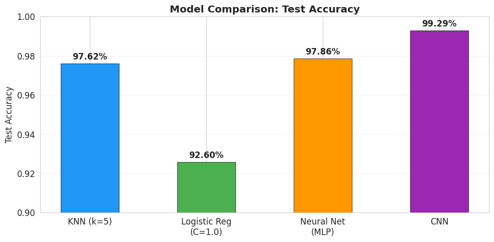
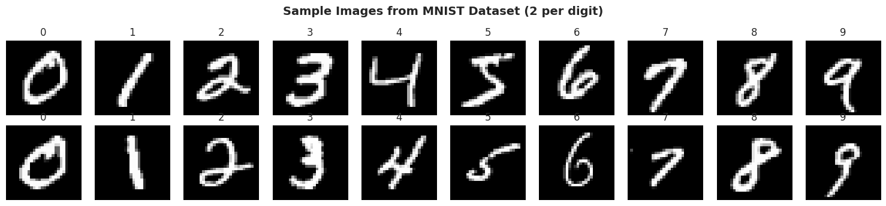
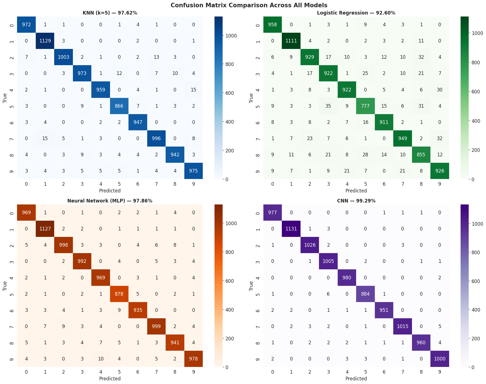
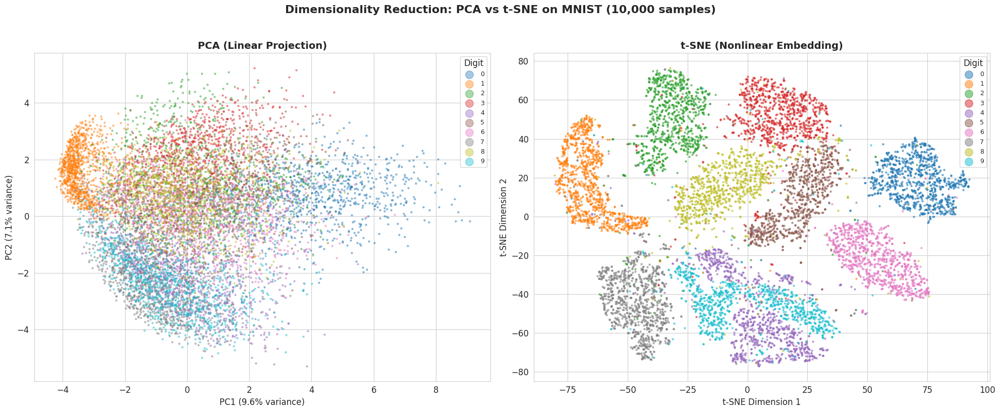
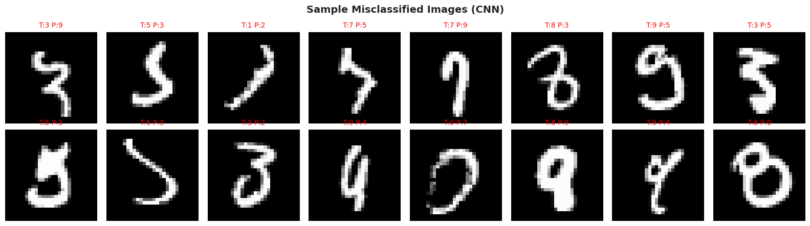

# Handwritten Digit Recognition (MNIST)

**NUS MSc in AI and Innovation — Machine Learning coursework**

Classifies handwritten digits (0–9) from the MNIST dataset using four different modeling approaches — from a simple distance-based classifier up to a convolutional neural network — and compares them head-to-head on accuracy, error rate, and training time. Also includes a PCA vs. t-SNE dimensionality-reduction analysis to visualize why the models perform the way they do.

## Results at a glance

| Model | Test Accuracy | Error Rate | Training Time |
|---|---:|---:|---:|
| Logistic Regression (C=1.0) | 92.60% | 7.40% | 71.5s |
| KNN (k=5) | 97.62% | 2.38% | 4.7s |
| Neural Network (MLP) | 97.86% | 2.14% | 37.2s |
| **CNN** | **99.29%** | **0.71%** | 549.3s |

The CNN misclassified only 71 of 10,000 test images.



## Dataset

MNIST: 70,000 grayscale images of handwritten digits, 28×28 pixels, fetched directly via `sklearn.datasets.fetch_openml` (60,000 train / 10,000 test, classes roughly balanced at ~9–11% each).



## Approach

1. **Preprocessing** — normalized pixel values from [0, 255] to [0, 1] for faster, more stable gradient-based optimization and meaningful distance calculations.
2. **KNN** — reduced 784 → 50 dimensions with PCA (82.5% variance retained) before fitting, since raw pixel-distance KNN is expensive at this dimensionality; tuned k ∈ {1, 3, 5, 7, 9} with distance weighting. Best: k=5.
3. **Logistic Regression** — multinomial (softmax) classifier as a linear baseline; tuned the regularization strength C ∈ {0.01, 0.1, 1.0, 10.0}. Best: C=1.0.
4. **MLP** — feedforward network, Input(784) → Dense(128, ReLU) → Dense(64, ReLU) → Dense(10, softmax), trained with Adam and early stopping (patience=5) on a 10% validation split.
5. **CNN** — Conv2D(32, 3×3) → MaxPool → Conv2D(64, 3×3) → MaxPool → Flatten → Dense(128, ReLU) → Dropout(0.5) → Dense(10, softmax), exploiting the 2D spatial structure of the images rather than treating pixels as a flat vector.
6. **Dimensionality reduction** — PCA (linear, preserves global variance) and t-SNE (nonlinear, preserves local neighborhood structure) both used to project the 784-dimensional feature space to 2D for visualization.



## Key findings

- **Spatial structure matters most.** The CNN's ~1.4-point accuracy edge over the MLP comes entirely from exploiting the 2D layout of pixels via convolution — the two models otherwise see the same information.
- **Nonlinearity matters.** The ~5-point gap between Logistic Regression (linear) and KNN/MLP (nonlinear) shows digit recognition fundamentally needs nonlinear decision boundaries.
- **KNN is surprisingly competitive** for such a simple, training-free method — distance-weighted KNN on PCA-reduced features comes within 1.7 points of MLP.
- **Hardest digits**: 5, 8, and 9 are the most frequently confused across all models (curved, overlapping strokes); the CNN reduces these errors the most.
- **PCA vs. t-SNE**: the first 2 principal components capture only 16.8% of variance and show overlapping digit clusters, while t-SNE reveals clean, well-separated clusters per digit — confirming the classes are inherently well-separable, which explains why several models clear 97%+ accuracy.





## Possible extensions

- Data augmentation (rotations, shifts, elastic distortions) to improve CNN robustness
- Deeper architectures (e.g. ResNet) or transfer learning
- Ensembling CNN + KNN predictions to reduce errors on ambiguous digits

## Repo contents

```
mnist-digit-recognition/
├── mnist_digit_recognition_colab_cnn.ipynb   # Full notebook: EDA → KNN → Logistic Regression → MLP → CNN → PCA/t-SNE
└── figures/                                  # Key plots exported from the notebook
```

## Running the notebook

Built for Google Colab — `fetch_openml` downloads MNIST automatically, no local dataset files needed.

1. Upload the notebook to Colab (or open directly from GitHub via Colab's "Open notebook → GitHub" tab).
2. Run all cells sequentially (Runtime → Run all).
3. The CNN cell benefits substantially from a GPU runtime (Runtime → Change runtime type → GPU) — training took ~550s on the environment this was run in.

**Requirements:** `numpy`, `scikit-learn`, `tensorflow`/`keras`, `matplotlib`, `seaborn`

## Tech stack

Python, scikit-learn (KNN, Logistic Regression, MLP, PCA, t-SNE), TensorFlow/Keras (CNN), matplotlib, seaborn.

---
Part of the [nus-masters-projects](../) portfolio — coursework from the NUS MSc in AI and Innovation.
